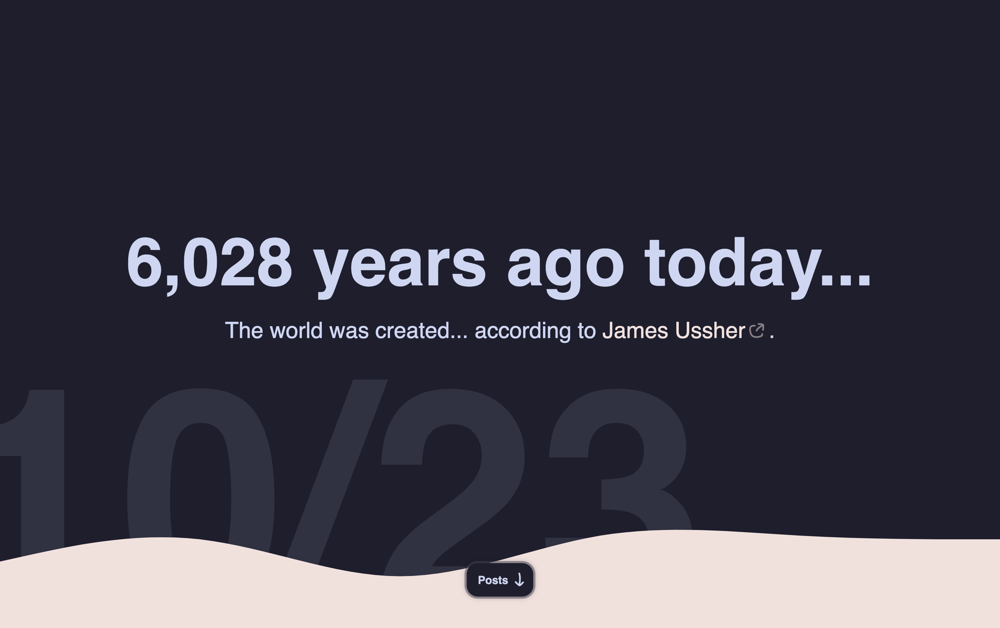

# Daily

<picture>
    <source media="(prefers-color-scheme: dark)" srcset="./assets/preview-dark.png">
    <source media="(prefers-color-scheme: light)" srcset="./assets/preview-light.png">
    
</picture>

This is a static site generator, intended to be used with GitHub Pages.
I try to add a fun daily event/ historical fact, and may occasionally add posts!
This pre-processes markdown files with pandoc into html files, and generates an RSS feed from the posts.

# Running
Requires [Pandoc](https://pandoc.org/installing.html) and [Node.js](https://nodejs.org/en/download/package-manager)

```
npm install
node index.js
```

This will populate the `generated_html/` directory with the site files.


